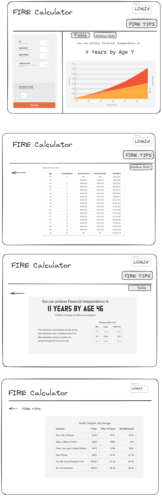

# Project Title

FIRE Calculator 

## Overview
The FIRE Calculator web app is a tool designed to help users plan for financial independence and early retirement. It will allow users to input their financial data, calculate when they can achieve financial independence, and offer personalized savings tips.

### Problem

1. To provide a user-friendly interface for calculating financial independence.
2. To offer actionable financial tips to expedite users' journey to FIRE.
3. To create a system that allows users to save their financial data.

### User Profile

* Individuals planning their retirement strategy.
* Users from any demographic interested in assessing their financial roadmap towards independence.

### Features

* Authentication: Secure user registration and login functionality.
* FIRE Calculation: Dynamic calculation of financial independence based on user inputs.
* Result Visualization: Graphical display of financial growth and FIRE projections.
* Data Storage: Ability to save calculations for future reference (for logged-in users).
* FIRE Tips: Presentation of financial tips to improve saving strategies.

## Implementation

### Tech Stack

* Frontend: React, JavaScript, HTML, CSS.
* Backend: Node.js, Express.
* Database: MySQL.
* Libraries: Axios for HTTP requests, knex, bcrypt for password hashing, and react-router for navigation.

### APIs
* Register
* Login
* Save Calculations
* Get Calculations

### Sitemap

* Home page
* Table
* Withdraw Rate
* FIRE Tips

### Mockups

### Backend Implementation

* A MySQL database will store user profiles, saved calculations.
* Node.js with Express will handle the server-side logic, including user authentication, data processing for calculations, and interaction with the MySQL database.

### Data

* User Data: Store and manage user accounts, financial inputs, and calculation results.
* Security: Implement best practices for data security and user privacy.

### Endpoints

FIRE Calculation Endpoints
User Authentication Endpoints
FIRE Calculation Endpoints
User Data Management Endpoints
FIRE Tips Endpoints
Chart Data Endpoints
User Profile Management Endpoints

### Auth

* User register / Login

## Roadmap

1. Setup the core application with authentication disabled.

    Client-Side: Implement React project with routes and placeholder pages.
    
    Server-Side: Develop an Express project with routing and placeholder responses.

2.  Implement core features.
    
    Develop and integrate calculation logic for FIRE projections.
    
    Create interactive charts for financial visualization.

3.  Add user-specific features.

    Implement user authentication with JWT tokens.

    Enable users to save and retrieve past calculations.

4.  Deploy the application.

    Deploy both client and server sides, ensuring that updates are reflected in production.

5.  Feature enhancement and finalization.

    Polish user interfaces based on user feedback.

    Prepare for demo day and final presentation of the project.

6.  Bug fixes

7.  DEMO DAY

## Nice-to-haves

User Net worth chart